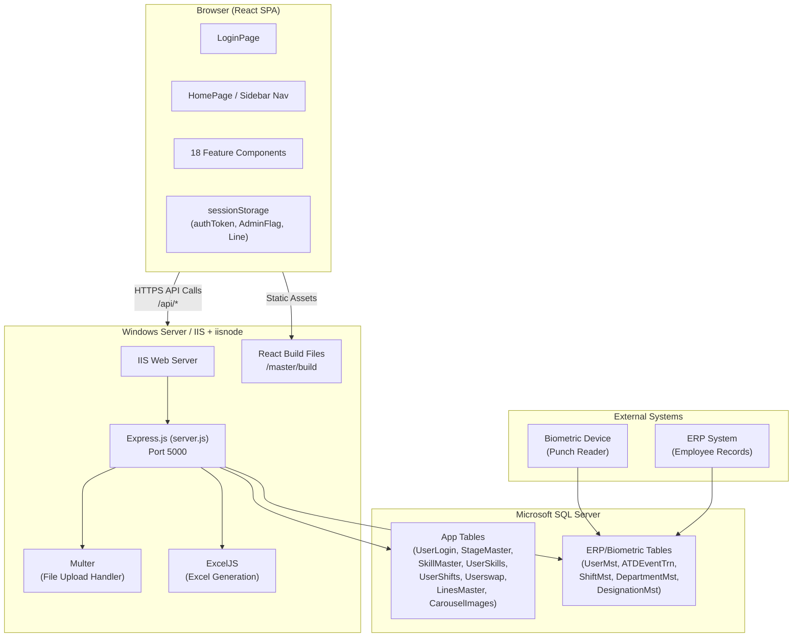
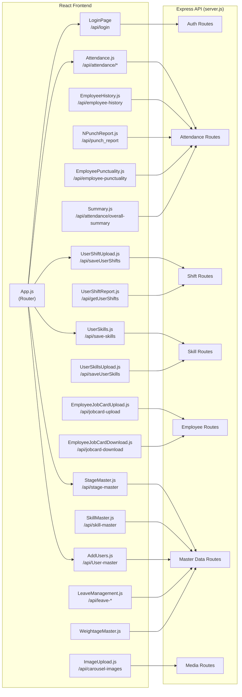
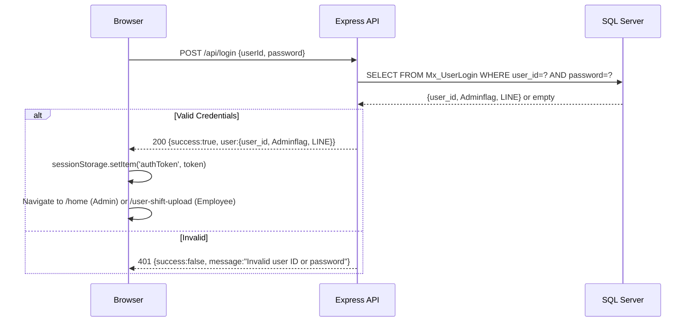
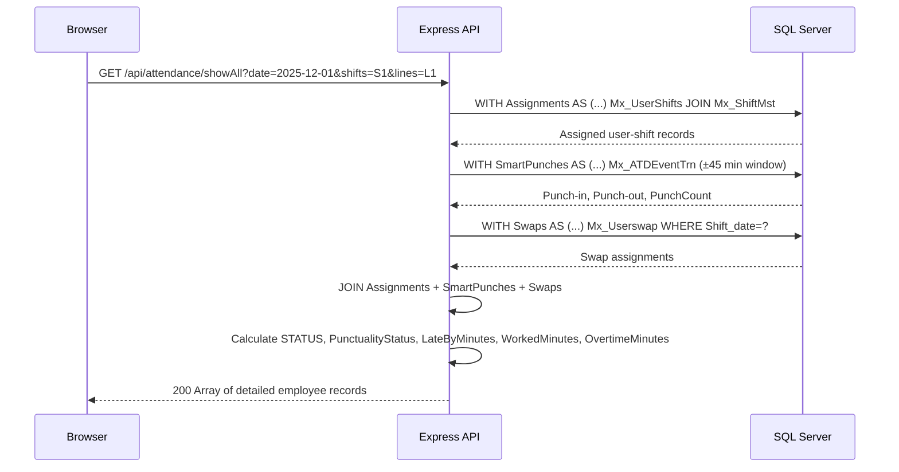
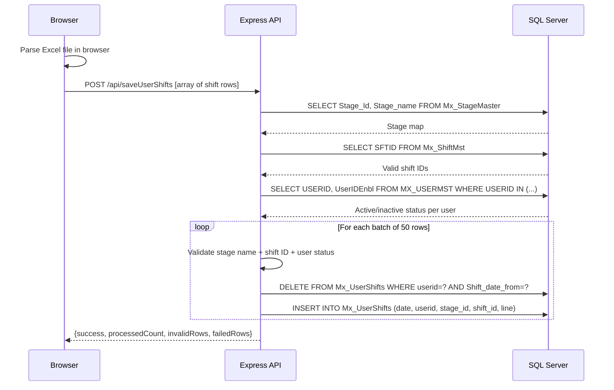

# MAAST Architecture Documentation

## System Overview

MAAST is a 3-tier web application:

```
Browser (React SPA)
       ↕ HTTPS (Axios)
Express.js API Server (Node.js / IIS + iisnode)
       ↕ mssql driver (TCP)
Microsoft SQL Server 2019+
       ↑
Biometric System (populates Mx_ATDEventTrn, Mx_UserMst)
```

The frontend is a **React Single Page Application** served as static files by the Express backend. All API calls go to the same origin, avoiding CORS issues in production.

---

## Architecture Diagram



---

## Component Interaction Diagram



---

## Data Flow Diagram

### Login Flow


---

### Attendance Query Flow


---

### Shift Upload Flow


---

## Technology Decisions

| Decision | Rationale |
|---|---|
| Single `server.js` file | Rapid development for internal tool; easy deployment on IIS via iisnode |
| mssql with msnodesqlv8 | Supports Windows authentication against on-prem SQL Server, required in the network environment |
| React session storage for auth | Simple stateless session management; sufficient for intranet tool |
| ExcelJS for Excel generation | Full XLSX support with data validation (dropdown lists in upload templates) |
| Multer in-memory storage | Images stored as base64 in SQL; avoids file system dependency |
| 500MB body limit | Required for large Excel payloads with many shift records |
| IIS + iisnode deployment | Windows Server infrastructure already available; avoids additional tooling |
