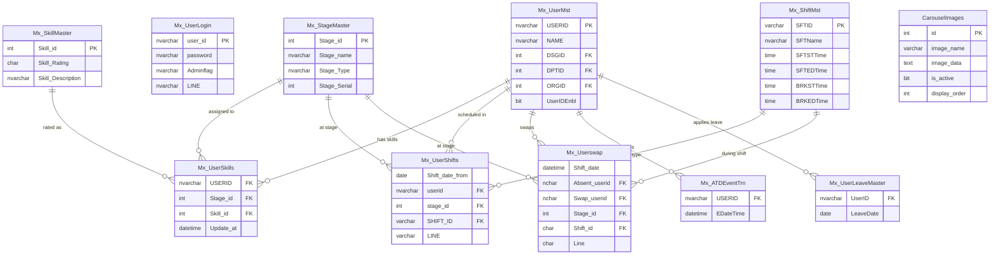

# MAAST Database Schema Documentation

> **Database:** Microsoft SQL Server  
> **Database Name:** `MSSCOSEC` (configurable via `.env`)  
> **Driver:** `mssql` with `msnodesqlv8` (supports Windows Authentication)

---

## Tables Overview

| Table | Purpose |
|---|---|
| `Mx_UserLogin` | Application login credentials and role flags |
| `Mx_UserMst` | Master employee records (from biometric/ERP system) |
| `Mx_StageMaster` | Production stage definitions |
| `Mx_SkillMaster` | Skill rating categories |
| `Mx_UserSkills` | Employee skill assignments per stage |
| `Mx_ShiftMst` | Shift definitions (timings) |
| `Mx_UserShifts` | Daily shift allocation per employee |
| `Mx_Userswap` | Employee swap/cover-for assignments |
| `Mx_ATDEventTrn` | Biometric punch event transactions |
| `Mx_UserLeaveMaster` | Leave records per employee |
| `Mx_DepartmentMst` | Department master (read-only reference) |
| `Mx_DesignationMst` | Designation master (read-only reference) |
| `Mx_OrganizationMst` | Organization/Unit master |
| `Mx_CustomGroup1Mst` | Custom group/category master |
| `CarouselImages` | Dashboard announcement images |
| `Mx_LinesMaster` | Production line master table |

---

## Table Definitions

### `Mx_UserLogin`
**Purpose:** Stores login credentials for MAAST application users. Separate from the biometric employee master — a user here grants access to the dashboard.

| Column | Type | Constraints | Description |
|---|---|---|---|
| `user_id` | NVarChar(50) | PK, NOT NULL | Unique login identifier |
| `password` | NVarChar(100) | NOT NULL | Password (plain text — should be hashed) |
| `Adminflag` | NVarChar(1) | NOT NULL | `'1'`=Admin, `'0'`=Employee |
| `LINE` | NVarChar(255) | NULL | Comma-separated line access list (e.g., `'L1,L2'`) |

**Indexes:** PK on `user_id`

---

### `Mx_UserMst` (Source/Biometric ERP Table — read-mostly)
**Purpose:** Master record of all employees in the organization, synced from biometric/ERP system.

| Column | Type | Constraints | Description |
|---|---|---|---|
| `USERID` | NVarChar(20) | PK | Employee ID |
| `NAME` | NVarChar(100) | | Full display name |
| `FirstName` | NVarChar | | First name |
| `MiddleName` | NVarChar | | Middle name |
| `LastName` | NVarChar | | Last name |
| `FullName` | NVarChar | | Full name override |
| `JoinDT` | DateTime | | Date of joining |
| `Qualification` | NVarChar | | Educational qualification |
| `DSGID` | Int | FK → Mx_DesignationMst | Designation ID |
| `DPTID` | Int | FK → Mx_DepartmentMst | Department ID |
| `ORGID` | Int | FK → Mx_OrganizationMst | Organization/Unit ID |
| `CG1ID` | Int | FK → Mx_CustomGroup1Mst | Custom group |
| `UserIDEnbl` | Bit | | `1`=Active, `0`=Inactive employee |
| `IsAuthHost` | Bit | | Excludes from attendance if admin host |
| `Enrolldt` | DateTime | | Enrollment date |

---

### `Mx_StageMaster`
**Purpose:** Defines production stages (e.g., Assembly, Quality Check). Ordered by `Stage_Serial`.

| Column | Type | Constraints | Description |
|---|---|---|---|
| `Stage_id` | Int | PK, Identity | Auto-increment stage ID |
| `Stage_name` | NVarChar(100) | NOT NULL | Stage display name |
| `Stage_Type` | NVarChar(50) | | Category/type label |
| `Stage_Serial` | Int | NOT NULL | Display/sort order (1-based, no gaps) |

**Relationships:**
- Referenced by `Mx_UserSkills.Stage_id`
- Referenced by `Mx_UserShifts.stage_id`
- Referenced by `Mx_Userswap.Stage_id`

**Business Logic:** When a stage is added/deleted, serial numbers are automatically resequenced across all stages in a transaction.

---

### `Mx_SkillMaster`
**Purpose:** Defines the available skill rating levels.

| Column | Type | Constraints | Description |
|---|---|---|---|
| `Skill_id` | Int | PK, Identity | Auto-increment |
| `Skill_Rating` | Char(2) | NOT NULL | Short code (e.g., `'A'`, `'B'`, `'C'`) |
| `Skill_Description` | NVarChar(100) | NOT NULL, UNIQUE | Description (e.g., `'Expert'`) |

**Relationships:**
- Referenced by `Mx_UserSkills.Skill_id`

---

### `Mx_UserSkills`
**Purpose:** Maps employees to their skill rating at each production stage.

| Column | Type | Constraints | Description |
|---|---|---|---|
| `USERID` | NVarChar(20) | FK → Mx_UserMst | Employee ID |
| `Stage_id` | Int | FK → Mx_StageMaster | Production stage |
| `Skill_id` | Int | FK → Mx_SkillMaster | Skill level |
| `Update_at` | DateTime | DEFAULT GETDATE() | Last update timestamp |
| `State` | Int | | Status flag |

**Indexes:** Recommended on `(USERID, Stage_id)`

---

### `Mx_ShiftMst`
**Purpose:** Defines all shift types with their timing windows.

| Column | Type | Description |
|---|---|---|
| `SFTID` | VarChar(5) | PK, Shift code (e.g., `'S1'`, `'S2'`) |
| `SFTName` | NVarChar(50) | Display name |
| `SFTSTTime` | Time | Shift start time |
| `SFTEDTime` | Time | Shift end time |
| `BRKSTTime` | Time | Break start time |
| `BRKEDTime` | Time | Break end time |

**Note:** If `SFTEDTime < SFTSTTime`, the shift crosses midnight (night shift). All attendance logic handles this case.

---

### `Mx_UserShifts`
**Purpose:** Records daily shift allocations per employee. One row = one employee assigned to one shift on one date.

| Column | Type | Constraints | Description |
|---|---|---|---|
| `Shift_date_from` | Date | NOT NULL | Assignment date |
| `Shift_date_to` | Date | | End date (often same as from) |
| `userid` | NVarChar(20) | FK → Mx_UserMst | Employee |
| `stage_id` | Int | FK → Mx_StageMaster | Assigned stage |
| `SHIFT_ID` | VarChar(5) | FK → Mx_ShiftMst | Shift code |
| `LINE` | VarChar(10) | | Production line (e.g., `'L1'`) |

**Indexes:** Recommended on `(Shift_date_from, userid)`, `(Shift_date_from, SHIFT_ID, LINE)`

**Business Logic:** Upload (POST /api/saveUserShifts) deletes existing record for same user+date before inserting, ensuring one shift per employee per day.

---

### `Mx_Userswap`
**Purpose:** Records swap assignments — when one employee covers another's absent position.

| Column | Type | Description |
|---|---|---|
| `Shift_date` | DateTime | Date of swap |
| `Stage_id` | Int | FK → Mx_StageMaster |
| `Shift_id` | Char(2) | FK → Mx_ShiftMst |
| `Line` | Char(2) | Production line |
| `Absent_userid` | NChar(15) | The absent employee |
| `Swap_userid` | NChar(15) | The employee covering |

---

### `Mx_ATDEventTrn` (Source Biometric Table — read-only)
**Purpose:** Raw punch events from biometric readers. Each row = one punch event.

| Column | Type | Description |
|---|---|---|
| `USERID` | NVarChar(20) | Employee who punched |
| `EDateTime` | DateTime | Exact punch timestamp |

**Indexes:** Critical — must have index on `(USERID, EDateTime)` for attendance queries to be performant.

**Usage:** All attendance detection, punch-in/out calculation, and punctuality analysis reads from this table.

---

### `Mx_UserLeaveMaster`
**Purpose:** Tracks leave taken by employees.

| Column | Type | Description |
|---|---|---|
| `UserID` | NVarChar(20) | FK → Mx_UserMst |
| `LeaveDate` | Date | Date of leave |
| *(additional columns)* | | Leave type, approver, etc. |

---

### `CarouselImages`
**Purpose:** Stores dashboard announcement/notice images as base64-encoded data in SQL.

| Column | Type | Description |
|---|---|---|
| `id` | Int | PK, Identity |
| `image_name` | VarChar(255) | Original filename |
| `description` | NVarChar(MAX) | Caption/description |
| `image_data` | Text | Base64 data URL |
| `mime_type` | VarChar(100) | MIME type (image/jpeg, etc.) |
| `file_size` | Int | File size in bytes |
| `is_active` | Bit | `1`=visible, `0`=soft-deleted |
| `display_order` | Int | Sort order |
| `created_date` | DateTime | DEFAULT GETDATE() |
| `updated_date` | DateTime | DEFAULT GETDATE() |

---

### `Mx_LinesMaster`
**Purpose:** Centralized list of production lines.

| Column | Type | Description |
|---|---|---|
| `LineID` | Int | PK, Identity |
| `LineName` | NVarChar(50) | Unique line name |
| `CreatedDate` | DateTime | DEFAULT GETDATE() |

---

## Entity Relationship Diagram

---

## Key Indexes (Recommended)

See `database_indexing_strategy.sql` in the project root for full indexing scripts.

| Table | Index Columns | Purpose |
|---|---|---|
| `Mx_ATDEventTrn` | `(USERID, EDateTime)` | Attendance lookup (CRITICAL for performance) |
| `Mx_UserShifts` | `(Shift_date_from, userid)` | Shift lookup by date |
| `Mx_UserShifts` | `(Shift_date_from, SHIFT_ID, LINE)` | Attendance filtering |
| `Mx_Userswap` | `(Shift_date, Swap_userid)` | Swap lookup |
| `Mx_UserSkills` | `(USERID, Stage_id)` | Skill lookup |
| `Mx_StageMaster` | `Stage_Serial` | Serial ordering |
